<p align="center">
  <h1 align="center">K-GAAP → K-IFRS Conversion Engine</h1>
  <p align="center">
    일반기업회계기준(K-GAAP) 재무제표를 한국채택국제회계기준(K-IFRS)으로 자동 전환하는<br/>
    End-to-End 컨버전 파이프라인
  </p>
</p>

<p align="center">
  
  
  
  
  
  <a href="https://kifrs-conversion-engine.vercel.app"></a>
</p>

<p align="center">
  <b>🔗 Live Demo →</b> <a href="https://kifrs-conversion-engine.vercel.app">https://kifrs-conversion-engine.vercel.app</a>
</p>

---

## Overview

K-GAAP에서 K-IFRS로의 회계기준 전환은 계정과목 재분류, 기준서별 영향도 분석, 전환조정 산출, 내부자료 식별 등 수십 단계의 판단이 필요한 고비용 프로세스입니다.

이 프로젝트는 **기업명 하나만 입력하면** DART 전자공시에서 재무데이터를 수집하고, 40+ 정규식 매핑 규칙과 업종별 가중치 로직으로 K-IFRS 전환근거를 자동 생성하는 시스템입니다.

### Key Capabilities

| 기능 | 설명 |
|------|------|
| **비정형 Excel 파싱** | 양식이 아닌 *내용*(계정과목 출현빈도, 키워드 밀도)으로 18종 시트를 자동 판별. 202개 정규식 패턴으로 열 용도·계정과목 인식 |
| **DART API 파이프라인** | 기업 검색 → 개황 조회 → 회계기준 검증 → BS/IS/CF 수집 → 감사보고서 추출까지 자동 수행 |
| **K-IFRS 전환 매핑** | 40+ 계정과목 × K-IFRS 기준서 매핑 규칙, 업종별(제조/도소매/건설/IT/금융) 영향도 가중치 자동 적용 |
| **전환 변동내역 산출** | K-GAAP 장부금액 대비 K-IFRS 추정금액·조정액을 자동 계산, 무변동/변동 근거 제시 |
| **내부자료 체크리스트** | 8개 영역(리스·금융상품·종업원급여·수익인식 등)별 필요 자료를 자동 식별 |
| **교차검증** | 파싱 결과 ↔ DART 공시 데이터 간 차이를 자동 비교, 정확도 등급(A~D) 산정 |
| **웹 인터페이스** | Next.js 기반 SPA에서 검색·전환·엑셀 다운로드·내부자료 업로드까지 원스톱 처리 |

---

## Architecture

<p align="center">
  
</p>

---

## Project Structure

```
.
├── excel_parser.py              # 비정형 Excel 자동 인식 파서 (1,041 lines)
│                                #   - 18종 시트 유형 판별 (내용 기반)
│                                #   - 202개 정규식 패턴 기반 계정과목 인식
│                                #   - 열 용도 자동 추론 (헤더 + 데이터 타입)
│
├── dart_api.py                  # DART OpenAPI 클라이언트 (552 lines)
│                                #   - 기업 검색 및 고유번호 해석
│                                #   - 재무제표 주요계정·전체계정 조회
│                                #   - 감사보고서 공시서류 검색
│
├── dart_converter.py            # K-GAAP→K-IFRS 전환 엔진 (690 lines)
│                                #   - 40+ 계정 × K-IFRS 기준서 매핑
│                                #   - 업종별 영향도 가중치 (5개 업종)
│                                #   - 전환조정·변동내역 자동 산출
│                                #   - 8개 영역 내부자료 체크리스트
│
├── test_dart_live.py            # DART API 통합 테스트 (293 lines)
│
├── references/
│   ├── auto_mapping_logic.md    # 자동 매핑 로직 설계 문서
│   └── regex_tuning_notes.md    # 정규식 튜닝 기록
│
└── web/                         # Next.js 웹 애플리케이션
    ├── src/
    │   ├── app/
    │   │   ├── page.tsx         # 메인 UI (1,135 lines)
    │   │   └── api/             # 6개 API 라우트
    │   │       ├── search/      #   기업 검색
    │   │       ├── convert/     #   전환 실행
    │   │       ├── download/    #   Excel 다운로드
    │   │       ├── apply-internal/ # 내부자료 반영
    │   │       ├── ai-analyze/  #   AI 분석
    │   │       └── ai-validate/ #   AI 검증
    │   ├── lib/
    │   │   ├── converter.ts     # 전환 엔진 TS 포팅 (730 lines)
    │   │   ├── dart-api.ts      # DART API TS 클라이언트 (553 lines)
    │   │   ├── excel-export.ts  # Excel 출력 (ExcelJS)
    │   │   ├── internal-data-parser.ts  # 내부자료 파싱 (632 lines)
    │   │   └── ai-engine.ts     # AI 검증 엔진 (324 lines)
    │   └── data/
    │       └── corp-codes.json  # 기업코드 캐시
    └── vercel.json              # Vercel 배포 설정
```

---

## How It Works

### 1. 비정형 Excel 파싱

기존 도구들이 **고정된 양식**을 전제로 하는 것과 달리, 이 파서는 **내용 기반(Content-Based)**으로 동작합니다.

```
입력: 어떤 양식의 감사보고서 Excel이든 상관없음
  ↓
Step 1. 시트별 키워드 출현빈도 + 가중치 점수로 시트 유형 판별
Step 2. 헤더 행 = 키워드 매칭 점수가 가장 높은 행
Step 3. 열 용도 = 헤더 텍스트 + 실제 데이터 타입(숫자/문자)으로 추론
Step 4. 계정과목 = 202개 정규식 패턴 매칭 + 구조적 위치 기반 추론
  ↓
출력: 정규화된 {시트유형, 계정코드, 계정명, 당기금액, 전기금액, ...}
```

### 2. DART 연동 → 전환 파이프라인

```
기업명 입력 (예: "비제바노")
  ↓
DART 기업 검색 → corp_code 확보
  ↓
기업개황 조회 → 업종코드, 결산월, 상장구분 확인
  ↓
회계기준 확인 → K-GAAP 여부 검증 (K-IFRS면 전환 불필요 알림)
  ↓
재무제표 수집 → BS/IS/CF 주요계정 + 전체 상세계정
  ↓
K-IFRS 전환근거 매핑 → 40+ 규칙 × 업종별 가중치
  ↓
전환 변동내역 산출 → 계정별 K-GAAP→K-IFRS 조정액 계산
  ↓
체크리스트 생성 → 해당 기업에 필요한 내부자료 식별
  ↓
결과 출력 → 웹 대시보드 / Excel 다운로드
```

### 3. K-IFRS 매핑 규칙 예시

| K-GAAP 계정 | K-IFRS 기준서 | 영향도 | 전환 시 변동사항 |
|-------------|---------------|--------|------------------|
| 매출채권 | IFRS 9 금융상품 | HIGH | ECL(기대신용손실) 모형 적용 필수 |
| 임차보증금 | IFRS 16 리스 | HIGH | 보증금 현재가치 평가, 리스부채 인식 |
| 퇴직급여충당부채 | IAS 19 종업원급여 | HIGH | DBO 보험수리적 평가 필수 |
| 매출액 | IFRS 15 수익 | HIGH | 5단계 수익인식 모형, 본인/대리인 판단 |
| 전환사채 | IAS 32 금융상품 표시 | HIGH | 부채+자본 분리 (복합금융상품) |

---

## Tech Stack

| Layer | Technology | Purpose |
|-------|-----------|---------|
| **Frontend** | Next.js 14, React 18, TypeScript | SPA, SSR 지원 |
| **API** | Next.js API Routes | 서버리스 엔드포인트 |
| **Core Engine** | Python 3.9+ / TypeScript | 파싱·전환·매핑 로직 |
| **Data Source** | DART OpenAPI (금융감독원) | 기업 재무데이터 수집 |
| **Excel I/O** | openpyxl (Python), ExcelJS (TS) | 비정형 파싱 + 구조화 출력 |
| **AI Validation** | OpenAI API (optional) | 전환 결과 검증·분석 보조 |
| **Deploy** | Vercel | 서버리스 배포 |

---

## Getting Started

### Prerequisites

- Python 3.9+
- Node.js 18+
- DART OpenAPI 인증키 ([발급 링크](https://opendart.fss.or.kr))

### Python Engine

```bash
pip install openpyxl requests

# 감사보고서 Excel 파싱
python excel_parser.py <audit_report.xlsx>

# DART → K-IFRS 자동 전환
python -c "
from dart_converter import DartKifrsConverter
converter = DartKifrsConverter(api_key='YOUR_DART_API_KEY')
result = converter.convert('비제바노', '2024')
converter.export_excel(result, 'output.xlsx')
"
```

### Web Application

```bash
cd web
cp .env.local.example .env.local
# .env.local에 DART_API_KEY 설정

npm install
npm run dev
# http://localhost:3000
```

### Run Tests

```bash
python test_dart_live.py
```

---

## Metrics

| 항목 | 수치 |
|------|------|
| 총 소스코드 | **6,645 lines** (Python 2,751 + TypeScript 3,894) |
| Excel 파싱 패턴 | **202개** 정규식 |
| 시트 유형 자동 인식 | **18종** (시산표, BS, IS, 자본변동표, CF 등) |
| K-IFRS 매핑 규칙 | **40+ 계정과목** × 17개 기준서 |
| 업종별 가중치 | **5개 업종** (제조/도소매/건설/IT·서비스/금융) |
| 체크리스트 영역 | **8개** (리스, 금융상품, 종업원급여, 수익인식 등) |
| API 라우트 | **6개** 엔드포인트 |

---

## License

This project is licensed under the MIT License.
